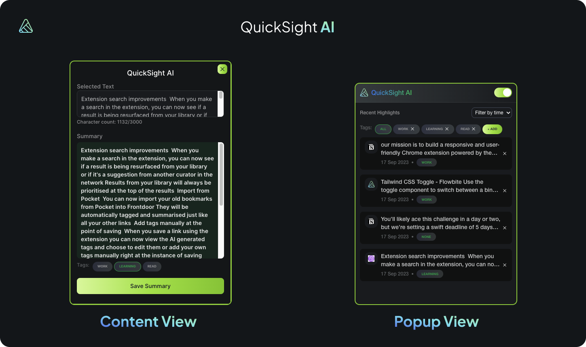

<p align="center">
  
  <h1 align="center">QuickSight AI Chrome Extension</h1>
</p>

---

## 📖 Table of Contents

- [Installation](#installation)
  - [Procedures](#procedures)
- [Screenshots](#screenshots)
  - [Extension](#extension)

---

## 🛠 Installation <a name="installation"></a>

### 📋 Procedures <a name="procedures"></a>

1. **Clone this Repository**
   ```bash
   git clone https://github.com/skdev24/quicksight-ai-extension
   ```
2. **Update Metadata**

   - Change `name` and `description` in `package.json`. This will auto-synchronize with the manifest.

3. **Install Dependencies**

   ```bash
   yarn install  # or npm i
   ```

   > Note: Make sure your Node.js version is >= 16.6 (>= 18 recommended).

4. **Run Development Server**

   ```bash
   yarn dev  # or npm run dev
   ```

5. **Load Extension on Chrome**

   1. Open Chrome browser.
   2. Navigate to `chrome://extensions`.
   3. Enable Developer Mode.
   4. Click on "Load unpacked extension".
   5. Select the `dist` folder in this project (generated after running dev or build).

6. **Production Build**
   ```bash
   yarn build  # or npm run build
   ```

---

## 📸 Screenshots <a name="screenshots"></a>

### 🌟 Extension <a name="extension"></a>


